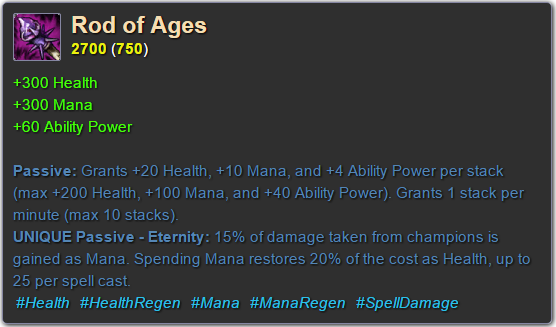
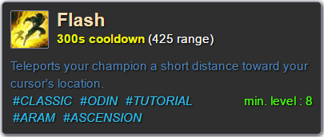
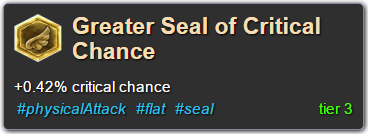
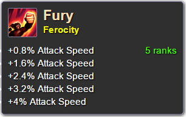
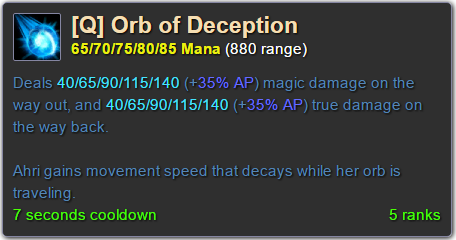
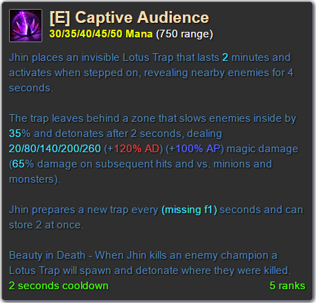

# league-tooltips - screenshots

## Champion

Code :

`

`

## Item

Code :

`

`

## Summoner spell

Code :

`

`

## Rune

Code :

`

`

## Mastery

Code :

`

`

## Champion spell

Code :

`

`

Code :

`

`
