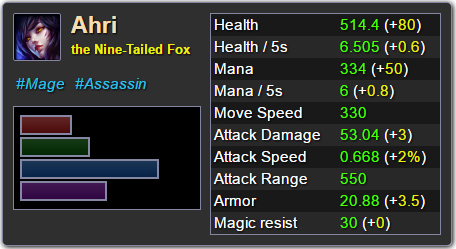

# league-tooltips

> Express middleware for League of Legends tooltips : champions, items, summoner spells, runes, masteries and champion spells.


[![npm version][version-badge]][version-url]
[![Known Vulnerabilities][vulnerabilities-badge]][vulnerabilities-url]
[![dependency status][dependency-badge]][dependency-url]
[![devdependency status][devdependency-badge]][devdependency-url]
[![downloads][downloads-badge]][downloads-url]

[![NPM][npm-stats-badge]][npm-stats-url]



[more screenshots here](PREVIEWS.md)

## Demo : [here](https://tooltips.lol-item-sets-generator.org/)

[Used in production by _feeder.lol-item-sets-generator.org_](https://github.com/league-of-legends-devs/feeder.lol-item-sets-generator.org/blob/master/src/routes/tooltips.js).

## Compatibility

### Server

Requires Node 4.0.0 or upper.

### Client

**BEWARE !** The client part is not compatible with modern front end frameworks (with dynamic DOM elements). See the [#1](https://github.com/league-of-legends-devs/league-tooltips/issues/1) issue for more informations.

Working on :

* Internet Explorer 11
* Most modern browsers

## Installation

`npm install --save league-tooltips`

## How to use

### Server :
```javascript
const express = require('express');
const leagueTips = require('league-tooltips');

const app = express();

app.use(leagueTips('RIOT_API_KEY', leagueTips.REGIONS.EUROPE_WEST));

app.listen(3000);
```

### Client :
```html
<!DOCTYPE html>
<html>
  <head>
    <meta charset="utf-8">
    <title>Test</title>
    <script src="/league-tips.min.js"></script>
  </head>
  <body>
    <main>
      <div class="league-tooltip" data-champion="103">
        <!-- This div will show the Ahri tooltip on hover (Ahri ID : 103) -->
      </div>
    </main>
  </body>
</html>
```

You must set the `league-tootip` class and one of these `data-*` attributes :

* `data-champion` : `<champion id>`

 e.g. : `data-champion="103"` (Ahri)

* `data-item` : `<item id>`

 e.g. : `data-item="3027"` (Rod of Ages)

* `data-summonerspell` : `<summonerspell id>`

 e.g. : `data-summonerspell="4"` (Flash)

* `data-rune` : `<rune id>`

 e.g. : `data-rune="5311"` (Greater Seal of Critical Chance)

* `data-mastery` : `<mastery id>`

 e.g. : `data-mastery="6111"` (Fury)

* `data-championspell` : `id.key` (`.` is a separator)

 e.g. : `data-championspell="103.Q"`


The value must be the ID (from the [Riot API](https://developer.riotgames.com/)) of the element you want to show. If an element has more than one tag in this list, the list order will define the priority and the first occurrence will be used.

## API

`leagueTips(apiKey, region, options)` is an [express](http://expressjs.com/) [middleware](http://expressjs.com/en/guide/using-middleware.html).

It will return a `function (req, res, next) {}`.

### `apiKey`

**required**

The Riot API key. You can get one [here](https://developer.riotgames.com/).

### `region`

**required**

The location of the servers to query.
Riot has multiple servers across the world at different locations. They are exported in the `REGIONS` constant.

Allowed values :
* `REGIONS.BRAZIL`: `'br'`
* `REGIONS.EUROPE`: `'eune'`
* `REGIONS.EUROPE_WEST`: `'euw'`
* `REGIONS.KOREA`: `'kr'`
* `REGIONS.JAPAN`: `'jp'`
* `REGIONS.LATIN_AMERICA_NORTH`: `'lan'`
* `REGIONS.LATIN_AMERICA_SOUTH`: `'las'`
* `REGIONS.NORTH_AMERICA`: `'na'`
* `REGIONS.OCEANIA`: `'oce'`
* `REGIONS.RUSSIA`: `'ru'`
* `REGIONS.TURKEY`: `'tr'`

### `options`

**optional**, default values :

```javascript
options = {
  url: '/',
  fileName: 'league-tips.min.js',
  cors: { // the CORS default options are only set if the 'cors' option is defined
    origin: '*',
    methods: 'GET,PUT,POST,DELETE',
    headers: 'Content-Type'
  },
  cache: {
    TTL: 60 * 60 * 12,
    redis: { // the Redis default options are only set if the 'redis' option is defined, otherwise : fallback to in-memory caching
      host: 'localhost',
      port: 6379,
      prefix: 'league-tooltips_'
    }
  },
  prod: false
};
```

#### - `url` (String)

**default value** : `'/'` (e.g. : `/tooltips`)

The route where the static files and the datas will be served.

#### - `fileName` (String)

**default value** : `league-tips.min.js`

The name of the Javasript file that will be served to the client.

*e.g.*

`leagueTips('<API_KEY>', '<REGION>', { url: '/tooltips', fileName: 'league-tips.min.js' })`

will serve the file at `/tootips/league-tips.min.js`.

#### - `cors` (Object)

CORS properties. No CORS if this property is undefined.

* `origin` (String), defaults to `'*'` if `cors` is defined
* `methods` (String), defaults to `'GET,PUT,POST,DELETE'` if `cors` is defined
* `headers` (String), defaults to `'Content-Type'` if `cors` is defined

#### - `cache` (Object)

The datas can be cached in two ways : in-memory caching (by default) or with [Redis](https://redis.io).

* `TTL`: (Number), defaults to `60*60*12` (43200 seconds)
* `redis`: // fallback to in-memory caching if no Redis configuration
  * `host`: (String), defaults to `'localhost'`
  * `port`: (Integer), defaults to `6379`
  * `host`: (String), defaults to `'league-tooltips_'`

#### - `prod` (Boolean)

**default value** : `false`

Defines wether the script runs in a production environment or not. Set to `true` for a production environment.

## Language

You can change the language by setting the `leagueTooltips.locale` value.
The locale is the language of the retrieved datas (e.g., `en_US`, `es_ES`, `fr_FR` ...).

## Debug

This module uses the [debug module](https://www.npmjs.com/package/debug).
In order to show the debug logs, you must enable the debugging logs.

* **Server :** you must set the `league-tooltips:*` value in the `DEBUG` environment variable :
 * Linux : `export DEBUG=league-tooltips:*`
 * Windows : `set DEBUG=league-tooltips:*`
* **Browser :** type the following in the console : `leagueTooltips.debug.enable('*')`


## How does it work ?

The express middleware will retrieve the required datas from the Riot API and store them. It will also serve a javascript file that must be executed by the client.

e.g.

```javascript
app.use(leagueTips('RIOT_API_KEY', 'euw', { url: '/tooltips', fileName: 'league-tips.min.js' }));
```
will serve the javascript file with the `/tooltips/league-tips.min.js` route.

The JS file will listen to the `onmouseover` events of all elements that have the `league-tooltip` class and show a tooltip when it triggers.
Every mouse hover will launch a query to the `/tooltips/` api route (if not stored in the browser cache) and retrieve the datas to show in the tooltip.

## TODO

### Release :
- [ ] IE9 compatibility
- [ ] Champion passives
- [ ] Display 'Energy' instead of 'Mana' for manaless champions
- [ ] Allow to choose between setting the data id or the data key in `data-*`
- [ ] **Add the mouseover listener to the newly created tooltips in the DOM** (using [Mutation Observers](https://www.w3.org/TR/2014/CR-dom-20140508/#mutation-observers)) in order to be compatible with modern front end frameworks - see [#1](https://github.com/league-of-legends-devs/league-tooltips/issues/1)
- [ ] Make the API return the proper HTTP error code (usually always 200)
- [ ] Modular client file

### Ideas :
- [ ] Serve the templates in `league-tooltips.min.js` as lodash template in order to prevent direct templates requests to the server
- [ ] Use CSS modules
- [ ] Champion.GG integration ?
- [ ] Serve the rendered tooltip.html file with express ? => { renderServerSide : true }. Otherwise, use [express-state](https://github.com/yahoo/express-state).
- [ ] Custom tooltip.html in middleware config
- [ ] Start the queries before the mouseover event triggers and cache the results
- [ ] Export the client files in a `league-tooltips-client` module with the Universal Module Definition
- [ ] Cancel the client requests if the user no longer hovers the tooltip element (RxJS style ?)

## License

MIT License

Copyright (c) 2016-2018 **Nicolas COUTIN**

Permission is hereby granted, free of charge, to any person obtaining a copy
of this software and associated documentation files (the "Software"), to deal
in the Software without restriction, including without limitation the rights
to use, copy, modify, merge, publish, distribute, sublicense, and/or sell
copies of the Software, and to permit persons to whom the Software is
furnished to do so, subject to the following conditions:

The above copyright notice and this permission notice shall be included in all
copies or substantial portions of the Software.

THE SOFTWARE IS PROVIDED "AS IS", WITHOUT WARRANTY OF ANY KIND, EXPRESS OR
IMPLIED, INCLUDING BUT NOT LIMITED TO THE WARRANTIES OF MERCHANTABILITY,
FITNESS FOR A PARTICULAR PURPOSE AND NONINFRINGEMENT. IN NO EVENT SHALL THE
AUTHORS OR COPYRIGHT HOLDERS BE LIABLE FOR ANY CLAIM, DAMAGES OR OTHER
LIABILITY, WHETHER IN AN ACTION OF CONTRACT, TORT OR OTHERWISE, ARISING FROM,
OUT OF OR IN CONNECTION WITH THE SOFTWARE OR THE USE OR OTHER DEALINGS IN THE
SOFTWARE.

Anyway, if you earn money on my open source work, I will fucking end you :)

[version-badge]: https://img.shields.io/npm/v/league-tooltips.svg
[version-url]: https://www.npmjs.com/package/league-tooltips
[vulnerabilities-badge]: https://snyk.io/test/npm/league-tooltips/badge.svg
[vulnerabilities-url]: https://snyk.io/test/npm/league-tooltips
[dependency-badge]: https://david-dm.org/ilshidur/league-tooltips.svg
[dependency-url]: https://david-dm.org/ilshidur/league-tooltips
[devdependency-badge]: https://david-dm.org/ilshidur/league-tooltips/dev-status.svg
[devdependency-url]: https://david-dm.org/ilshidur/league-tooltips#info=devDependencies
[downloads-badge]: https://img.shields.io/npm/dt/league-tooltips.svg
[downloads-url]: https://www.npmjs.com/package/league-tooltips
[npm-stats-badge]: https://nodei.co/npm/league-tooltips.png?downloads=true&downloadRank=true
[npm-stats-url]: https://nodei.co/npm/league-tooltips
